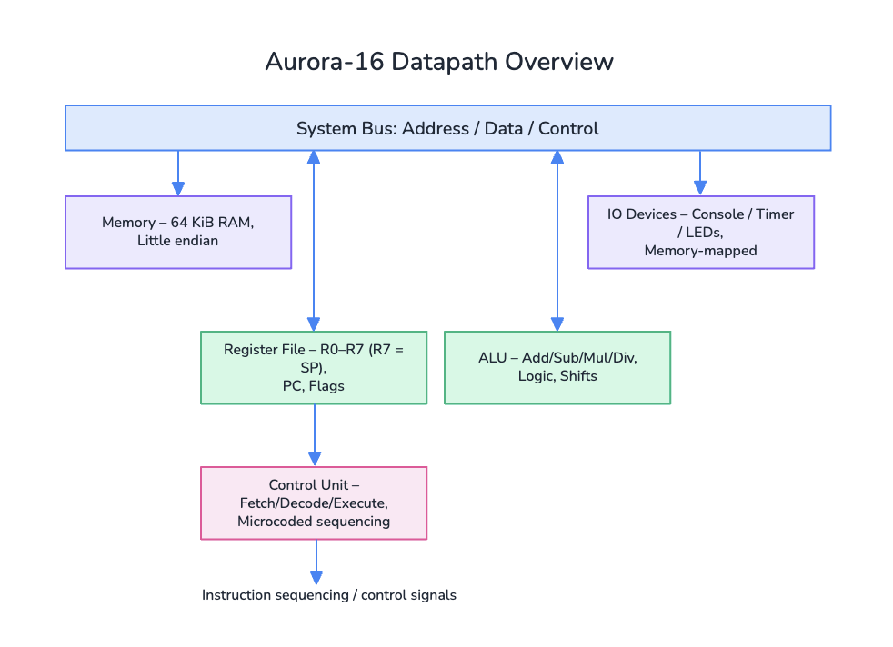

# Aurora-16 Architecture and ISA

## CPU schematic



Aurora-16 is a single-cycle, von Neumann CPU with a Harvard-style conceptual split between instruction control and data movement. The datapath consists of:

- **Register file:** eight 16-bit general purpose registers R0–R7. `R7` doubles as the stack pointer (SP) with a reset value of `0xFF00`. Program counter (PC) is separate but flows through the fetch path.
- **ALU:** performs arithmetic (add/sub/mul/div), logic (and/or/xor/not), and shifts. It emits result + status flags.
- **Control unit:** orchestrates the fetch → decode → execute pipeline, handles branching, stack control, and IO instructions.
- **Bus and memory:** a 64 KiB address space with byte-addressable RAM, and memory-mapped IO devices occupying the top 256 bytes.
- **Devices:** console UART-style output, a programmable interval timer, and an 8-bit LED panel.

## Instruction format & encoding

Every instruction begins with a 32-bit header: one byte opcode, two operand descriptor bytes, and a modifier byte. Descriptors encode operand type + payload:

```
bit 7..5 : operand type
bit 4..0 : payload (register index, port id, etc.)
```

Extended words are appended for immediates, absolute addresses, or register-index offsets. Example (LDI R0, #0x1234):

```
+--------+-------------+-------------+----------+----------+
| opcode | operand A   | operand B   | modifier | literal  |
| 0x02   | reg R0      | imm         | 0x00     | 0x1234   |
+--------+-------------+-------------+----------+----------+
```

### Addressing modes

| Type | Descriptor bits | Meaning |
|------|-----------------|---------|
| `None` | `000` | Unused operand |
| `Register` | `001` | Register payload selects R0–R7 (R7=SP) |
| `RegisterIndirect` | `010` | `[Rx]` memory at register value |
| `RegisterIndexed` | `011` | `[Rx + disp16]` (additional 16-bit signed offset) |
| `Immediate` | `100` | Literal 16-bit value |
| `Absolute` | `101` | Memory address literal |
| `Port` | `110` | IO port id (used by IN/OUT) |

### Status flags

| Flag | Bit | Description |
|------|-----|-------------|
| `C`  | 0 | Carry / no-borrow (addition carry, subtraction no-borrow). |
| `Z`  | 1 | Zero result. |
| `N`  | 2 | Negative bit (bit 15 of result). |
| `V`  | 3 | Signed overflow. |

### Instruction set summary

| Opcode | Mnemonic | Description |
|--------|----------|-------------|
| `0x00` | `NOP` | No operation |
| `0x01` | `HALT` | Stop the CPU |
| `0x02` | `LDI dst, imm` | Load literal into register/memory |
| `0x03` | `MOV dst, src` | Copy between operands |
| `0x04` | `LOAD dst, addr` | Load from memory/IO into dst |
| `0x05` | `STORE src, addr` | Store operand to memory/IO |
| `0x06` | `ADD dst, src` | dst = dst + src |
| `0x07` | `ADDI dst, imm` | dst = dst + imm |
| `0x08` | `SUB dst, src` | dst = dst - src |
| `0x09` | `SUBI dst, imm` | dst = dst - imm |
| `0x0A` | `MUL dst, src` | dst = dst * src |
| `0x0B` | `DIV dst, src` | dst = dst / src (flags C+V raised on div-by-zero) |
| `0x0C` | `AND dst, src` | Bitwise AND |
| `0x0D` | `OR dst, src` | Bitwise OR |
| `0x0E` | `XOR dst, src` | Bitwise XOR |
| `0x0F` | `NOT dst` | Bitwise NOT |
| `0x10` | `SHL dst, src` | Logical shift left by lower 8 bits of src |
| `0x11` | `SHR dst, src` | Logical shift right |
| `0x12` | `CMP a, b` | Update flags from a - b |
| `0x13` | `JMP target` | Unconditional jump |
| `0x14` | `JZ target` | Jump if Z=1 |
| `0x15` | `JNZ target` | Jump if Z=0 |
| `0x16` | `JN target` | Jump if N=1 |
| `0x17` | `JC target` | Jump if C=1 |
| `0x18` | `CALL target` | Push PC, jump target |
| `0x19` | `RET` | Pop PC |
| `0x1A` | `PUSH src` | Push operand on stack |
| `0x1B` | `POP dst` | Pop into operand |
| `0x1C` | `OUT port, src` | Write byte to IO port |
| `0x1D` | `IN dst, port` | Read byte from IO port |
| `0x1E` | `ADJSP imm` | Adjust stack pointer by signed imm |
| `0x1F` | `SYS code` | Supervisor hook (debug prints, etc.) |

## Memory map

| Region | Address range | Notes |
|--------|----------------|-------|
| Program ROM/RAM | `0x0000 – 0x7FFF` | Default program origin at `0x0000`. |
| Data RAM | `0x8000 – 0xFEFF` | General data / stack (stack grows downward from `0xFF00`). |
| IO: Console UART | `0xFF00 – 0xFF0F` | `0xFF00` data (write), `0xFF01` status |
| IO: Timer | `0xFF10 – 0xFF1F` | Counter lo/hi, control, period registers |
| IO: LEDs | `0xFF20 – 0xFF2F` | 8-bit LED register |

All IO regions are mirrored for simplicity; accesses outside registered devices fall back to RAM.

## Fetch / compute / store overview

1. **Fetch:** PC-addressed word is read via the bus, opcode + operand descriptors decoded, and any literal words are fetched.
2. **Compute:** Control unit resolves operands (registers, immediates, memory accesses), drives the ALU, updates flags, and resolves control flow.
3. **Store:** Results commit back to registers, memory, or IO; PC is updated, and device tick hooks run each cycle.

The timer example in `docs/programs.md` walks through these cycles with concrete opcode-level detail.
